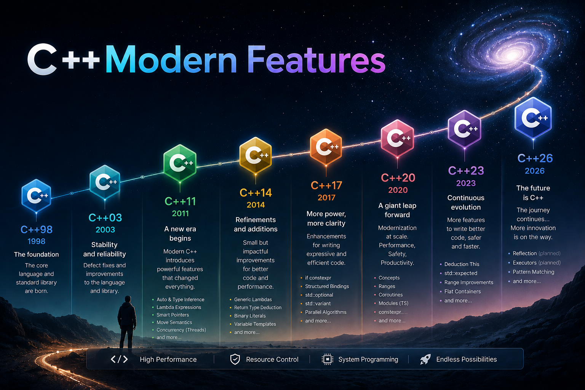

[🇺🇸 English](README.md) | [🇮🇷 فارسی](README.fa.md)

---

# C++ Modern Features

## 📚 C++ Standards Documentation

  

| C++ Version | Link to Documentation Page                                                                                  |
| ----------- | ----------------------------------------------------------------------------------------------------------- |
| C++98       |        |
| C++11       |       |
| C++14       |       |
| C++17       |       |
| C++20       |       |
| C++23       |       |
| C++26       |       |
| C++29       |  |

Note: This article was prepared and edited using explanations and rewrites provided by ChatGPT (OpenAI) and Qwen (Alibaba).

---
## 🤝 Contributors

| GitHub | LinkedIn | Email | Site | Telegram |
|--------|----------|-------|------|----------|
| [HadiAbbasi](https://github.com/HadiAbbasi) | [Hadi Abbasi](https://www.linkedin.com/in/hadi-abbasi-programmer/) | [Hadi Abbasi](mailto:hadi.abbasi.programmer@gmail.com) | [Hiens.org](https://hiens.org) | [Hadi Abbasi](https://t.me/Hadi_Abbasi_Programmer) |
| [mbr](https://github.com/mbr1376) | [mbr](https://www.linkedin.com/in/mbr1376/) | [mbr](mailto:m.roodsarabi76@gmail.com) | | [mbr](https://t.me/ad1mi2n) |
| [Ordikhani](https://github.com/Ordikhani) | | | | |

