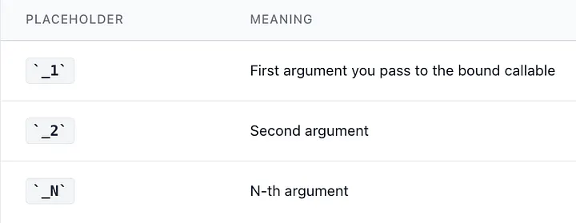

<div align="right">

[🇺🇸 English](./bind.md) | [🇮🇷 فارسی](../../fa/cpp11/bind.md)

</div>

# std::bind
In C++, the std::bind function is a part of the Standard Template Library (STL) and it is used to bind a function or a member function to a specific object or value. It creates a new function object by "binding" a function or member function to a specific object or value, allowing it to be called with a different number of arguments or with a different order of arguments.

```cpp
std::bind(function, object/value, arguments...);
```
**Parameters**:

- **function**: it is the member function that you want to bind. It can be a function pointer, a function object, or a member function pointer.
- **object/value**: the object or value to which you want to bind the function. For member functions, this is the object on which the member function will be called. For free functions, this argument can be ignored.
- **arguments**: are any additional arguments that should be passed to the function when it is called. These can include placeholders represented by std::placeholders::_1, std::placeholders::_2, etc, which can be used to specify where the arguments passed to the returned function object should be placed.

**Return Value**: The std::bind function in C++ returns a function object, also known as a "call wrapper" or "binder", that is a bound version of the original function or member function. This function object can be invoked like a regular function, but with some of its arguments pre-bound to specific values or objects.

The return type of the std::bind function is a type that is dependent on the function or member function being bound, the arguments passed to the std::bind function, and the placeholders used to specify where the arguments passed to the returned function object should be placed.


##  Example

### Partial Application

`std::bind` locks in some arguments ahead of time, giving you a new callable with fewer parameters.Press enter or click to view image in full size


```cpp
#include <functional>
#include <iostream>

int add(int a, int b) { return a + b; }

int main() {
    using namespace std::placeholders;

    // "Lock in" the first argument as 10.
    // _1 means "fill this in later with the first arg you give me."
    auto add_ten = std::bind(add, 10, _1);

    std::cout << add_ten(5) << "\n";   // 15
    std::cout << add_ten(20) << "\n";  // 30
}
```
#### Placeholders cheat sheet


### Binding Member Functions (the primary use case)

Member functions have a hidden this. `std::bind` fills it in for you.

```cpp
#include <functional>
#include <iostream>

struct Greeter {
    std::string name;
    void say_hello(const std::string& to) const {
        std::cout << name << " says hi to " << to << "!\n";
    }
};

int main() {
    using namespace std::placeholders;

    Greeter g{"Alice"};

    // Bind the object so we get a simple void(string) callable
    std::function<void(const std::string&)> greet =
        std::bind(&Greeter::say_hello, &g, _1);

    greet("Bob");   // Alice says hi to Bob!
}
```

## Exceptions
The std::bind function in C++ can throw an exception of type std::bad_function_call if the function or member function passed to it is not callable, for example, if it is a null pointer or an invalid function pointer. Additionally, the std::bind function can also throw an exception of type std::bad_alloc if there is not enough memory available to create the function object.

It is important to ensure that the function or member function passed to std::bind is callable and that there is enough memory available to create the function object before calling std::bind. Also, if the function or member function passed to the std::bind throws an exception, the function object returned by std::bind will propagate that exception to the caller when it is invoked.

```cpp
// C++ Program to Exceptions
#include <functional>
#include <iostream>

// function created
void myFunction()
{
    std::cout << "This function does something."
              << std::endl;
}

// Driver Code
int main()
{
    std::function<void()> func;
  
      // Normal condition
    try {
        func();
    }
      // Exception when binder created
    catch (std::bad_function_call& e) {
        std::cout << "Error: " << e.what() << std::endl;
    }
    return 0;
}
```
In the above program, a std::function object named func is created and initialized to an empty function object.
Then, when func() is called, it throws an exception of type std::bad_function_call because it's empty and it doesn't point to any function.
The exception is caught by the catch block and the error message is printed to the console.

It is important to note that this error is thrown at runtime, so it is important to have proper error handling in place to catch and handle these exceptions. The type of exception that is thrown in this case is std::bad_function_call which is a derived class of std::exception which is a standard C++ exception.


---
## 🤝 Contributors
<div align="center">

| GitHub | LinkedIn | Email | Site | Telegram |
|--------|----------|-------|------|----------|
| [mbr](https://github.com/mbr1376) | [mbr](https://www.linkedin.com/in/mbr1376/) | [mbr](m.roodsarabi76@gmail.com) | | [mbr](@ad1mi2n) |

</div>
