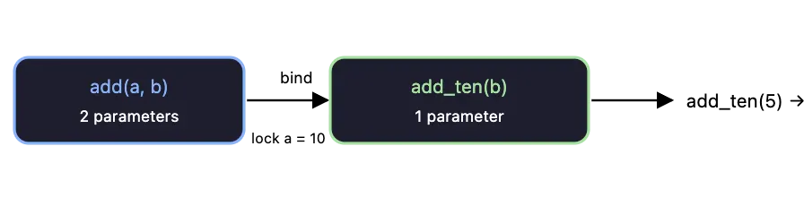

<div align="right">

[🇺🇸 English](./bind.md) | [🇮🇷 فارسی](../../fa/cpp11/bind.md)

</div>

# std::bind
In C++, the std::bind function is a part of the Standard Template Library (STL) and it is used to bind a function or a member function to a specific object or value. It creates a new function object by "binding" a function or member function to a specific object or value, allowing it to be called with a different number of arguments or with a different order of arguments.

```cpp
std::bind(function, object/value, arguments...);
```
**Parameters**:

- **function**: it is the member function that you want to bind. It can be a function pointer, a function object, or a member function pointer.
- **object/value**: the object or value to which you want to bind the function. For member functions, this is the object on which the member function will be called. For free functions, this argument can be ignored.
- **arguments**: are any additional arguments that should be passed to the function when it is called. These can include placeholders represented by std::placeholders::_1, std::placeholders::_2, etc, which can be used to specify where the arguments passed to the returned function object should be placed.

**Return Value**: The std::bind function in C++ returns a function object, also known as a "call wrapper" or "binder", that is a bound version of the original function or member function. This function object can be invoked like a regular function, but with some of its arguments pre-bound to specific values or objects.

The return type of the std::bind function is a type that is dependent on the function or member function being bound, the arguments passed to the std::bind function, and the placeholders used to specify where the arguments passed to the returned function object should be placed.


>`std::bind` locks in some arguments ahead of time, giving you a new callable with fewer parameters.Press enter or click to view image in full size


---
## 🤝 Contributors
<div align="center">

| GitHub | LinkedIn | Email | Site | Telegram |
|--------|----------|-------|------|----------|
| [mbr](https://github.com/mbr1376) | [mbr](https://www.linkedin.com/in/mbr1376/) | [mbr](m.roodsarabi76@gmail.com) | | [mbr](@ad1mi2n) |

</div>
