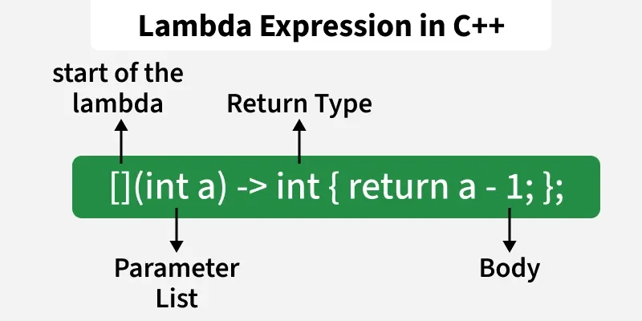

<div align="right">

[🇺🇸 English](./lambda.md) | [🇮🇷 فارسی](../../fa/cpp11/lambda.md)

</div>
---

# Lambda Expression
One of the most exciting features of C++11 is ability to create lambda functions (sometimes referred to as closures). What does this mean? A lambda function is a function that you can write inline in your source code (usually to pass in to another function, similar to the idea of a functor or function pointer). With lambda, creating quick functions has become much easier, and this means that not only can you start using lambda when you'd previously have needed to write a separate named function, but you can start writing more code that relies on the ability to create quick-and-easy functions.

> - **Used to assign custom logic to algorithms like sort, for_each, and find_if in C++ STL**.
> - **Used in Callbacks and Event Handling for asynchronous tasks and events.**

## why Lambda
 Imagine that you had an address book class, and you want to be able to provide a search function. You might provide a simple search function, taking a string and returning all addresses that match the string. Sometimes that's what users of the class will want. But what if they want to search only in the domain name or, more likely, only in the username and ignore results in the domain name? Or maybe they want to search for all email addresses that also show up in another list. There are a lot of potentially interesting things to search for. Instead of building all of these options into the class, wouldn't it be nice to provide a generic "find" method that takes a procedure for deciding if an email address is interesting? Let's call the method findMatchingAddresses, and have it take a "function" or "function-like" object. 

```cpp
#include <string>
#include <vector>

class AddressBook
{
    public:
    // using a template allows us to ignore the differences between functors, function pointers 
    // and lambda
    template<typename Func>
    std::vector<std::string> findMatchingAddresses (Func func)
    { 
        std::vector<std::string> results;
        for ( auto itr = _addresses.begin(), end = _addresses.end(); itr != end; ++itr )
        {
            // call the function passed into findMatchingAddresses and see if it matches
            if ( func( *itr ) )
            {
                results.push_back( *itr );
            }
        }
        return results;
    }

    private:
    std::vector<std::string> _addresses;
};
```
Anyone can pass a function into the findMatchingAddresses that contains logic for finding a particular function. If the function returns true, when given a particular address, the address will be returned. This kind of approach was OK in earlier version of C++, but it suffered from one fatal flaw: it wasn't quite convenient enough to create functions. You had to go define it somewhere else, just to be able to pass it in for one simple use. That's where lambdas come in.


## Struct Lambda

```cpp
auto func = [capture](parameters) -> return_type {
    cout << "Hello world";
};
func();
```
did you spot the lambda, starting with []? That identifier, called the capture specification, tells the compiler we're creating a lambda function. You'll see this (or a variant) at the start of every lambda function.

Next up, like any other function, we need an argument list: (). Where is the return value? Turns out that we don't need to give one. In C++11, if the compiler can deduce the return value of the lambda function, it will do it rather than force you to include it. In this case, the compiler knows the function returns nothing. Next we have the body, printing out "Hello World". This line of code doesn't actually cause anything to print out though--we're just creating the function here. It's almost like defining a normal function--it just happens to be inline with the rest of the code.
> parts
`[]` **cpature List:** bring outer variables into the lambda
`()` **parameters**
`->` **return_type**
`{...}` **function body**

## Variable Capture with Lambdas
 Although these kinds of simple uses of lambd are nice, variable capture is the real secret sauce that makes a lambda function great. Let's imagine that you want to create a small function that finds addresses that contain a specific name. Wouldn't it be nice if you could write code something like this?
```cpp
    // read in the name from a user, which we want to search
string name;
cin>> name;
return global_address_book.findMatchingAddresses( 
    // notice that the lambda function uses the the variable 'name'
    [&] (const string& addr) { return addr.find( name ) != string::npos; } 
);
```
We're able to take a variable declared outside of the lambda (name), and use it inside of the lambda. When findMatchingAddresses calls our lambda function, all the code inside of it executes--and when addr.find is called, it has access to the name that the user passed in. The only thing we needed to do to make it work is tell the compiler we wanted to have variable capture. I did that by putting [&] for the capture specification, rather than []. The empty [] tells the compiler not to capture any variables, whereas the [&] specification tells the compiler to perform variable capture.

We can create a simple function to pass into the find method, capturing the variable name, and write it all in only a few lines of code. To get a similar behavior without C++11, we'd either need to create an entire functor class or we'd need a specialized method on AddressBook. In C++11, we can have a single simple interface to AddressBook that can support any kind of filtering really easily.

## Lambda and the STL
One of the biggest beneficiaries of lambda functions are, no doubt, power users of the standard template library algorithms package. Previously, using algorithms like for_each was an exercise in contortions. Now, though, you can use for_each and other STL algorithms almost as if you were writing a normal loop. Compare:

```cpp
vector<int> v;
v.push_back( 1 );
v.push_back( 2 );
//...
for ( auto itr = v.begin(), end = v.end(); itr != end; itr++ )
{
    cout << *itr;
}
```
**whit**
```cpp
vector<int> v;
v.push_back( 1 );
v.push_back( 2 );
//...
for_each( v.begin(), v.end(), [] (int val)
{
    cout << val;
} );
```
**here's the kicker:** it turns out that for_each has about the same performance, and is sometimes even faster than a regular for loop.


## More on the new Lambda Syntax
By the way, the parameter list, like the return value is also optional if you want a function that takes zero arguments. Perhaps the shortest possible lambda expression is:
```cpp
int main()
{
    [] { cout << "Hello, my Greek friends"; }();
}
```
### retrurn value
By default, if your lambda does not have a return statement, it defaults to void. If you have a simple return expression, the compiler will deduce the type of the return value:
```cpp
[] () { return 1; } // compiler knows this returns an integer
```
If you write a more complicated lambda function, with more than one return value, you should specify the return type. (Some compilers, like GCC, will let you get away without doing this, even if you have more than one return statement, but the standard doesn't guarantee it.)

Lambdas take advantage of the optional new C++11 return value syntax of putting the return value after the function. In fact, you must do this if you want to specify the return type of a lambda. Here's a more explicit version of the really simple example from above:
```cpp
[] () -> int { return 1; } // now we're telling the compiler what we want
```
## How are Lambda Closures Implemented?

C++, being very performance sensitive, actually gives you a ton of flexibility about what variables are captured, and how--all controlled via the capture specification, []. You've already seen two cases--with nothing in it, no variables are captured, and with &, variables are captured by reference. If you make a lambda with an empty capture group, [], rather than creating the class, C++ will create a regular function. Here's the full list of options:
- `[]`	Capture nothing 
- `[&]`	Capture any referenced variable by reference
- `[=]`	Capture any referenced variable by making a copy
- `[=, &foo]`	Capture any referenced variable by making a copy, but capture variable foo by reference
- `[bar]`	Capture bar by making a copy; don't copy anything else
- `[this]`	Capture the this pointer of the enclosing class

```cpp
class Foo
{
public:
    Foo () : _x( 3 ) {}
    void func ()
    {
        // a very silly, but illustrative way of printing out the value of _x
        [this] () { cout << _x; } ();
    }

private:
        int _x;
};

int main()
{
    Foo f;
    f.func();
}
```
### Dangers and Benefits of Capture by Reference
When you capture by reference, the lambda function is capable of modifying the local variable outside the lambda function--it is, after all, a reference. But this also means that if you return a lamba function from a function, you shouldn't use capture-by-reference because the reference will not be valid after the function returns.

## Summery
With the introduction of lambdas in C++11, it became possible to define anonymous, inline functions; a feature that in many cases reduces code size, improves readability, simplifies unit testing, and provides a safer replacement for some uses of macros. As a result, the use of lambdas in C++ code is expected to increase significantly. This feature is supported in GCC 4.5 and later, MSVC 10, and Intel Compiler 11 and later.

---
## 🤝 Contributors

<div align="center">

| GitHub | LinkedIn | Email | Site | Telegram |
|--------|----------|-------|------|----------|
| [mbr](https://github.com/mbr1376) | [mbr](https://www.linkedin.com/in/mbr1376/) | [mbr](m.roodsarabi76@gmail.com) | | [mbr](@ad1mi2n) |

</div>