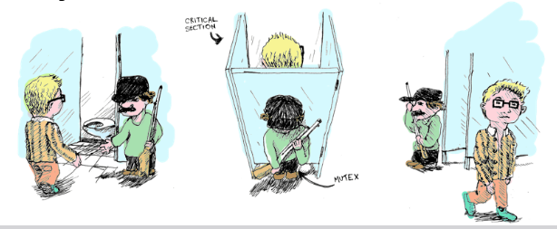
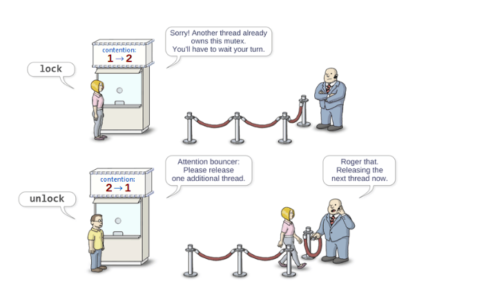
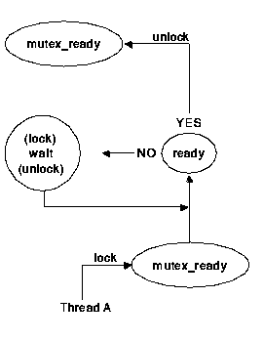

<div align="right">

[🇺🇸 English](./mutex.md) | [🇮🇷 فارسی](../../fa/cpp11/mutex.md)

</div>


# Mutex 

> **The mutex class is a synchronization primitive that can be used to protect shared data from being simultaneously accessed by multiple threads.**
> - Allows exclusive access to critical sections.
> - Ensures predictable behavior while accessing shared data.

**A mutex can only be in two states: locked or unlocked.**

- **Once a thread locks a mutex:**
- Other threads attempting to lock the same mutex are blocked.
- Only the thread that initially locked the mutex has the ability to unlock it.

- **This allows to protect regions of code.**

- **Typical mutex workflow:**
- Create and initialize a mutex variable
- Several threads attempt to lock the mutex
- Only one succeeds and that thread owns the mutex
- The owner thread performs some set of actions
- The owner unlocks the mutex
- Another thread acquires the mutex and repeats the process
- The mutext should be destroyed at the end.



## API for Cpp11
>`#include <mutex>`
> - Include the header file with mutex interface 

> `void mutex.lock()`
> - Locks a mutex; blocks if another thread has locked this mutex and owns it.

>  `void mutex.unlock()`
> - Unlocks mutex; after unlocking, other threads get a chance to lock the mutex.

> `bool mutex.try_lock()`
> - Tries to lock the mutex. Returns immediately. On successful lock acquisition returns true, otherwise returns false



## Unique lock - API
The mutexes are encapsulated by unique_lock classes, that simplify the usage, e.g. they automatically unlock the held mutex during their destruction (exceptions).

- `unique_lock unique_lock(mutex_type& m)`
Takes mutex m and and locks it
- `unique_lock unique_lock(mutex_type& m, std::defer_lock_t t)`
 Takes mutex m and and keeps it unlocked
- `unique_lock.lock()`
Locks the unique_lock
- `unique_lock.unlock()`
Unlocks the unique_lock

```cpp
void doJob(int id) {
    unique_lock<mutex> outputGuard(mMtx, defer_lock);
    this_thread::sleep_for(chrono::seconds((6*id+3) % 5));
    outputGuard.lock();
    cout<<"The job "<<id<<" has been completed!"<<endl;
    // The result of the ,,job" can be saved to a private variable.
    }
```

## Example

```cpp
#include<iostream>
#include<thread>
#include<vector>
#include<mutex>
using namespace std;
int  counter=0;
mutex counter_mutex;
void counterThread(){
    for(inti =0;i<10000000;++i){
        counter++;
        unique_lock<mutex> counter_lock(counter_mutex);
    }
    return;
}
int  main(){
    vector<thread> threads;
    for(int  i=0;i<4;++i){
        threads.push_back(thread(counterThread()))
    }
    for(int i=0;i<4;++i){
        threads[i].joint()
    }
    cout << counter <<endl;
    return 0;
}
```
```cpp
void* guyThread(void *args)
{
    argsStruct_t *tool = (argsStruct_t *)args;

    while(true)
    {
        {
            unique_lock<mutex> tool1_lock(*tool->tool1);

            cout << "Guy " << tool->threadID << " borrowed "
                 << tool->tool1Name << "." << endl;

            work();

            unique_lock<mutex> tool2_lock(*tool->tool2);

            cout << "Guy " << tool->threadID << " borrowed "
                 << tool->tool2Name << "." << endl;

            work();
        }

        if ((*tool->counter) > COUNTER_TRESHOLD)
            break;

        {
            unique_lock<mutex> counter_lock(*tool->counterMutex);
            (*tool->counter)++;
        }
    }

    return 0;
}


typedef struct argsStruct_t {
    mutex *counterMutex;
    int *counter;
    mutex *tool1;
    string tool1Name;
    mutex *tool2;
    string tool2Name;
    int threadID;
};


void work()
{
    for (int i = 0; i < WORK_ITERATIONS; i++);

}

int main()
{
    vector<thread> threadGuys;
    vector<mutex> mutexes(MUTEXES_COUNT);
    int counter = 0;

    vector<argsStruct_t> threadTools(THREADS_COUNT);

    threadTools[0] = {
        &mutexes[COUNTER],
        &counter,
        &mutexes[HAMMER],
        "hammer",
        &mutexes[SCREW_DRIVER],
        "screw driver",
        0
    };

    threadTools[1] = {
        &mutexes[COUNTER],
        &counter,
        &mutexes[SCREW_DRIVER],
        "screw driver",
        &mutexes[SAW],
        "saw",
        1
    };

    threadTools[2] = {
        &mutexes[COUNTER],
        &counter,
        &mutexes[SAW],
        "saw",
        &mutexes[HAMMER],
        "hammer",
        2
    };

    for (int i = 0; i < THREADS_COUNT; i++)
        threadGuys.push_back(
            thread(guyThread, (void *)&threadTools[i])
        );

    for (int i = 0; i < THREADS_COUNT; i++)
        threadGuys[i].join();

    return 0;
}
```
## Condition variables
- Allows signaling among threads
- Threads can wait until some event occurs
- Another thread wake up the waiting thread and inform it that the situation already occurred
- The woken up thread should check if all conditions are fulfilled and then continues.




### Condition variables - API
`#include <condition_variable>`
- Include the header with the condition variable interface

`void condition_variable.notify_one()`
- Sends a signal to a single thread waiting on condition variable.

`void condition_variable.notify_all()`
- Sends a signal to all threads waiting for condition_variable.

`void condition_variable.wait(unique_lock<mutex>& lock)`
- Unlocks lock and puts the thread to sleep until another thread wake it up by sending a signal. When the thread is woken up lock is locked again.

```cpp
{ unique_lock<mutex> lk(mtx)
while (!condition_ready())
cv.wait(lk);
compute_something();
}
```

`void condition_variable.wait(unique_lock<mutex>& lock, Predicate pred)`
- Equals to:

```cpp
while (!pred())
cv.wait(lk);

```
### Example
```cpp
#include <iostream>
#include <thread>
#include <mutex>
#include <condition_variable>
#include <queue>
#include <chrono>

std::queue<int> buffer;

std::mutex mtx;
std::condition_variable cv;

const int MAX_SIZE = 5;

// ---------------- Producer ----------------
void producer()
{
    for (int i = 1; i <= 10; ++i)
    {
        {
            std::unique_lock<std::mutex> lock(mtx);

            // اگر صف پر بود، Producer منتظر می‌ماند
            cv.wait(lock, [] {
                return buffer.size() < MAX_SIZE;
            });

            // تولید داده
            buffer.push(i);

            std::cout << "Producer: " << i << std::endl;
        }

        // اطلاع دادن به Consumer
        cv.notify_one();

        std::this_thread::sleep_for(
            std::chrono::milliseconds(500)
        );
    }
}

// ---------------- Consumer ----------------
void consumer()
{
    for (int i = 1; i <= 10; ++i)
    {
        int value;

        {
            std::unique_lock<std::mutex> lock(mtx);

            // اگر صف خالی بود، Consumer منتظر می‌ماند
            cv.wait(lock, [] {
                return !buffer.empty();
            });

            // برداشتن داده
            value = buffer.front();
            buffer.pop();

            std::cout << "Consumer: " << value << std::endl;
        }

        // اطلاع دادن به Producer
        cv.notify_one();

        std::this_thread::sleep_for(
            std::chrono::milliseconds(800)
        );
    }
}

// ---------------- main ----------------
int main()
{
    std::thread t1(producer);
    std::thread t2(consumer);

    t1.join();
    t2.join();

    return 0;
}
```
## 🤝 Contributors

<div align="center">

| GitHub | LinkedIn | Email | Site | Telegram |
|--------|----------|-------|------|----------|
| [mbr](https://github.com/mbr1376) | [mbr](https://www.linkedin.com/in/mbr1376/) | [mbr](m.roodsarabi76@gmail.com) | | [mbr](@ad1mi2n) |

</div>

