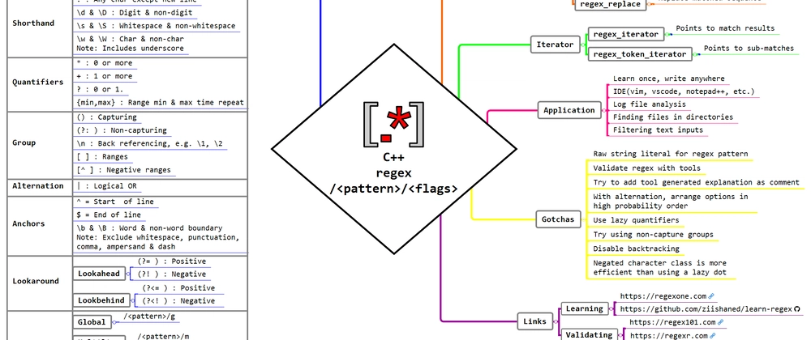

<div align="right">

[🇺🇸 English](./regex.md) | [🇮🇷 فارسی](../../fa/cpp11/regex.md)

</div>

# Regular expressions


I’ll quickly cover regular expression syntax and mention some features that aren’t supported by the standard C++ library. I’m told 3rd party libraries like Boost do support them but I like to keep things to the standard so that the code is cross platform. With that out of the way let’s start with a quick syntax overview of regular expressions based on the ECMAScript standard which C++ adheres to.


## Regex Pattern Syntax (Cheat Sheet)

### Character Classes


| Syntax | Description |
| :--- | :--- |
| `.` | Any character except newline |
| `[abc]` | Matches any one of `a`, `b`, or `c` |
| `[^abc]` | Matches any character except `a`, `b`, or `c` |
| `[a-z]` | Lowercase letters |
| `[0-9]` | Digits from `0` to `9` |
| `\w` | Word character: `[a-zA-Z0-9_]` |
| `\W` | Non-word character |
| `\d` | Digit from `0` to `9` |
| `\D` | Non-digit character |
| `\s` | Whitespace character: space, tab, or newline |
| `\S` | Non-whitespace character |

>**Note**: Use raw strings (R"(pattern)") in C++ to avoid escaping backslashes.


### Quantifiers
| Syntax | Description | Example |
| :--- | :--- | :--- |
| `*` | 0 or more repetitions   | `a*` → ``, a, aa, aaa... |
| `?` | 0 or 1 occurrence (optional) | `a?` → `` or `a` |
| `+` | 1 or more repetitions | `a+` → a, aa, aaa... |
| `{n}` | Exactly n repetitions | `a{3}` → aaa |
| `{n,}` | At least n repetitions | `a{2,}` → aa, aaa, ... |
| `{n,m}` | Between n and m repetitions | `a{2,3}` → aa, aaa |


### Anchors and Boundaries
| Symbol | Description |
| :--- | :--- |
| `^` | Start of string |
| `$` | End of string |
| `\b` | Word boundary |
| `\B` | Not a word boundary |

### Grouping and Alternation
| Syntax | Description |
| :--- | :--- |
| `(abc)` | Capturing group |
| `(?:abc)` | Non-capturing group |
| `a\|b` | Matches either `a` or `b` |


## std::regex
Regular expressions allow you to search, match, and manipulate strings based on patterns, not fixed characters. They are powerful for:

- Validating email addresses or phone numbers
- Extracting words or numbers from a document
- Replacing patterns within text
- Parsing logs, configuration files, and even code

```cpp
#include <regex>
#include <string>
#include <iostream>
```
## Main Type <regex>
| Type / Function | Purpose |
| :--- | :--- |
| `std::regex` | Holds the regular expression pattern |
| `std::smatch` | Holds match results for `std::string` |
| `std::cmatch` | Match results for C-style strings (`const char*`) |
| `std::regex_match` | Checks if the whole string matches the pattern |
| `std::regex_search` | Finds a substring match within the string |
| `std::regex_replace` | Replaces matched text with a new replacement string |


### `regex_match` vs `regex_search`

**Example: `regex_search` (Searches for pattern anywhere in the text)**
```cpp
std::string text = "Call me at 555-1234";
std::regex pattern(R"(\d{3}-\d{4})");
std::smatch match;
if (std::regex_search(text, match, pattern)) {
    std::cout << "Phone found: " << match[0] << "\n";
}
```
**Example: regex_match (Full string must match)**
```cpp
std::string input = "abc123";
std::regex pattern(R"([a-z]+[0-9]+)");
if (std::regex_match(input, pattern)) {
    std::cout << "Valid format\n";
}
```

**`regex_replace`**
```cpp
std::string html = "<b>Bold</b>";
std::regex tag(R"(<.*?>)");
std::string plain = std::regex_replace(html, tag, "");
std::cout << plain;  // Output: Bold
```

**std::regex_iterator**
std::regex_iterator is helpful when you need very detailed information about matched & sub-matches.
```cpp
const string input = "ABC:1->   PQR:2;;;   XYZ:3<<<"s;
    const regex r(R"((\w+):(\d))");

    const vector<smatch> matches{
        sregex_iterator{C_ALL(input), r},
        sregex_iterator{}
    };

    assert(matches[0].str(0) == "ABC:1" 
        && matches[0].str(1) == "ABC" 
        && matches[0].str(2) == "1");

    assert(matches[1].str(0) == "PQR:2" 
        && matches[1].str(1) == "PQR" 
        && matches[1].str(2) == "2");

    assert(matches[2].str(0) == "XYZ:3" 
        && matches[2].str(1) == "XYZ" 
        && matches[2].str(2) == "3");
```
Earlier(in C++11), there was a limitation that using std::regex_interator is not allowed to be called with a temporary regex object. Which has been rectified with overload from C++14.

**std::regex_token_iterator**

- `std::regex_token_iterator` is the utility you are going to use 80% of the time. It has a slight variation as compared to `std::regex_iterator`. The **difference between** `std::regex_iterator` & `std::regex_token_iterator` is:
    - `std::regex_iterator` points to match results.
    - `std::regex_token_iterator` points to sub-matches.
- In `std::regex_token_iterator`, each iterator contains only a single matched result.
```cpp
const string input = "ABC:1->   PQR:2;;;   XYZ:3<<<"s;
    const regex r(R"((\w+):(\d))");

    // Note: vector<string> here, unlike vector<smatch> as in std::regex_iterator
    const vector<string> full_match{
        sregex_token_iterator{C_ALL(input), r, 0}, // Mark `0` here i.e. whole regex match
        sregex_token_iterator{}
    };
    assert((full_match == decltype(full_match){"ABC:1", "PQR:2", "XYZ:3"}));

    const vector<string> cptr_grp_1st{
        sregex_token_iterator{C_ALL(input), r, 1}, // Mark `1` here i.e. 1st capture group
        sregex_token_iterator{}
    };
    assert((cptr_grp_1st == decltype(cptr_grp_1st){"ABC", "PQR", "XYZ"}));

    const vector<string> cptr_grp_2nd{
        sregex_token_iterator{C_ALL(input), r, 2}, // Mark `2` here i.e. 2nd capture group
        sregex_token_iterator{}
    };
    assert((cptr_grp_2nd == decltype(cptr_grp_2nd){"1", "2", "3"}));
```
**Inverted Match With std::regex_token_iterator**
```cpp
const string input = "ABC:1->   PQR:2;;;   XYZ:3<<<"s;
    const regex r(R"((\w+):(\d))");

    const vector<string> inverted{
        sregex_token_iterator{C_ALL(input), r, -1}, // `-1` = parts that are not matched
        sregex_token_iterator{}
    };
    assert((inverted == decltype(inverted){
                            "",
                            "->   ",
                            ";;;   ",
                            "<<<",
                        }));
```

##  Real-World Examples

**Validate Email**
```cpp
std::regex email(R"((\w+)(\.\w+)*@(\w+)\.(\w+))");
std::string s = "user.name@example.com";
std::smatch m;
if (std::regex_match(s, m, email)) {
    std::cout << "Valid email!\n";
}
```
**Extract All Words from a Sentence**
```cpp
std::string sentence = "C++ is powerful and fast";
std::regex word(R"(\w+)");
auto begin = std::sregex_iterator(sentence.begin(), sentence.end(), word);
auto end = std::sregex_iterator();
for (auto it = begin; it != end; ++it) {
    std::cout << "Word: " << it->str() << "\n";
```
**Replace URLs with Placeholder**

```cpp
std::string input = "Visit http://example.com now!";
std::regex url(R"(http[s]?://\S+)");
std::string clean = std::regex_replace(input, url, "[link]");
std::cout << clean;  // Output: Visit [link] now!
```
## Error Handling
```cpp
try {
    std::regex broken("[A-Z");  // Missing closing ]
} catch (const std::regex_error& e) {
    std::cerr << "Regex error: " << e.what() << '\n';
}
```
## Using Regex Flag

```cpp
std::regex pattern("hello", std::regex_constants::icase);
```


| Flag | Description |
| :--- | :--- |
| `std::regex::iccript` | Default syntax, similar to JavaScript |
|`std::regex::ECMAScript` | Default syntax, similar to JavaScript |
| `std::regex::basic` | POSIX basic regular-expression syntax |
| `std::regex::extended` | POSIX extended regular-expression syntax |

---
## 🤝 Contributors
<div align="center">

| GitHub | LinkedIn | Email | Site | Telegram |
|--------|----------|-------|------|----------|
| [mbr](https://github.com/mbr1376) | [mbr](https://www.linkedin.com/in/mbr1376/) | [mbr](m.roodsarabi76@gmail.com) | | [mbr](@ad1mi2n) |

</div>