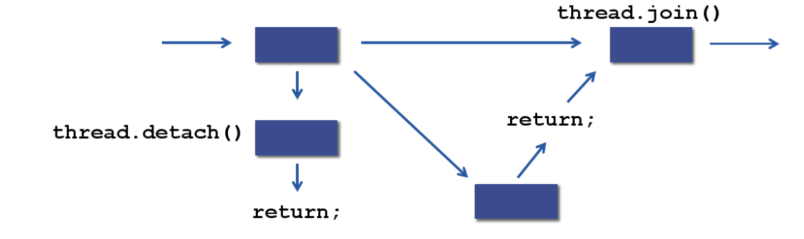

<div align="right">

[🇺🇸 English](./thread.md) | [🇮🇷 فارسی](../../fa/cpp11/thread.md)

</div>
---

# thread 
>**A thread is a representation of an execution/computation in a program. In C++11, as in much modern computing, a thread can – and usually does – share an address space with other threads. In this, it differs from a process, which generally does not directly share data with other processes. C++ has had a host of threads implementations for a variety of hardware and operating systems in the past, what’s new is a standard-library threads library.**

>- A new standard of C++11 defined API for threads, and synchronization primitives.
>- As the standard is accepted by all the modern compilers,it is portable to the majority of operating systems.
>- More high-level than pthreads, easier to write clean code.
>- Support for atomicity and memory ordering.
>- **Disadvantages:**
>- Not all synchronization primitives are implemented,e.g. barriers, read-write locks, semaphores...
>- A modern compiler is needed, it is not so well tested as pthreads

## Thread creation - constructor
A thread is launched by constructing a std::thread with a function or a function object:

> `thread thread( Function&& f, Args&&... args );`
> **Parameters:**
>- `f`  function that will be executed by the thread
>- `args` arguments for the start_routine function

```cpp
 #include <thread>
 void f();
 struct F {
         void operator()();
 };
 int main()
 {
         std::thread t1{f};     // f() executes in separate thread
     std::thread t2{F()};   // F()() executes in separate thread
 }
```
## Thread termination
> - It reaches the end of the start_routine
> - It calls return;


**Note:**
- The thread releases its stack during termination.
- Return value
- It is not possible to obtain return code from thread

## Joining threads


`void thread.join();`
- The function waits for the thread to terminate.
- It is not possible to join one thread more than once.
`bool thread.joinable()` 
- checks if it is possible to join the thread

```cpp
 int main()
 {
         std::thread t1{f};  // f() executes in separate thread
     std::thread t2{F()};    // F()() executes in separate thread
     t1.join();  // wait for t1
     t2.join();  // wait for t2
 }
```

### What happens if the thread is not joined?
- After the thread was terminated, the internal data are stored for further usage.
- The thread.join() function reads this data to provide status information about terminated thread. Afterwards, the function wipes the date out.
- If the thread.join() function is not called we need to let system know that we do not care about the thread and it can release the data.
- It can cause a serious memory leak problem when huge number of threads is used or each thread returns huge structure if those data are not wiped out.

### examples:
In general, we’d also like to get a result back from an executed task. With plain tasks, there is no notion of a return value; std::future is the correct default choice for that. Alternatively, we can pass an argument to a task telling it where to put its result: For example:

```cpp
 void f(vector<double>&);
 struct F {
     vector<double>& v;
     F(vector<double>& vv) :v{vv} { }
     void operator()();
 };
 int main()
 {
     std::thread t1{std::bind(f,some_vec)};  // f(some_vec) executes in separate thread
     std::thread t2{F(some_vec)};        // F(some_vec)() executes in separate thread
     t1.join();
     t2.join();
 }
```
In general, we’d also like to get a result back from an executed task. With plain tasks, there is no notion of a return value; std::future is the correct default choice for that. Alternatively, we can pass an argument to a task telling it where to put its result: For example:


```cpp
void f(vector<double>&, double* res);   // place result in res
struct F {
    vector<double>& v;
    double* res;
    F(vector<double>& vv, double* p) :v{vv}, res{p} { }
    void operator()();  // place result in res
};
int main()
{
    double res1;
    double res2;
    std::thread t1{std::bind(f,some_vec,&res1)};    // f(some_vec,&res1) executes in separate thread
    std::thread t2{F(some_vec,&res2)};      // F(some_vec,&res2)() executes in separate thread
    t1.join();
    t2.join();
    std::cout << res1 << ' ' << res2 << '\n';
}
```
But what about errors? What if a task throws an exception? If a task throws an exception and doesn’t catch it itself std::terminate() is called. That typically means that the program finishes. We usually try rather hard to avoid that. A std::future can transmit an exception to the parent/calling thread; that’s one reason to like futures. Otherwise, return some sort of error code.

When a thread goes out of scope the program is terminate()d unless its task has completed. That’s obviously to be avoided.

There is no way to request a thread to terminate (i.e. request that it exit as a soon as possible and as gracefully as possible) or to force a thread to terminate (i.e. kill it). We are left with the options of

designing our own cooperative “interruption mechanism” (with a piece of shared data that a caller thread can set for a called thread to check, and quickly and gracefully exit when it is set),
“going native” by using thread::native_handle() to gain access to the operating system’s notion of a thread,
kill the process `(std::quick_exit())`
kill the program `(std::terminate())`

## VDetaching threads


> `void thread.detach();`
> -  The function marks the thread identified by thread as detached. When a detached thread terminates, its resources are automatically released back to the system without the need for another thread to join with the terminated thread


## Example – Counter

### Task:
- Create global integer variable counter
- Create 4 threads and each thread:
- 10000000-times increment the counter
- Print the resulting value of the counter after all the threads are done!

```cpp
#include<iostream>
#include<thread>
#include<vector>
using namespace std;
int  counter=0;

void counterThread(){
    for(inti =0;i<10000000;++i){
        counter++;
    }
    return;
}
int  main(){
    vector<thread> threads;
    for(int  i=0;i<4;++i){
        threads.push_back(thread(counterThread()))
    }
    for(int i=0;i<4;++i){
        threads[i].joint()
    }
    cout << counter <<endl;
    return 0;
}
```
##  risks of multi-threaded programming
- Let's assume that a well-known bank company has asked you to implement  multi-threaded code to perform bank transactions.
- You start with the modest goal of allowing deposits.
- Clients deposit money and the amount gets credited to their accounts.
- As a result of having multiple threads running concurrently the following can happen

|step  | Thread 0 | Thread 1 | Account balance |
|---|---|---|---:|
| 1 | Client requests a deposit | Client requests a deposit | 0 CZK |
| 2 | Check current balance = 0 CZK | Check current balance = 0 CZK | 0 CZK |
| 3 | Ask for deposit 1000 CZK | Ask for deposit 2000 CZK | 0 CZK |
| 4 | Compute new balance = 1000 CZK | Compute new balance = 2000 CZK | 0 CZK |
| 5 | Write new balance to account 1000 CZK | Write new balance to account 2000 CZK | 2000 CZK |

>The problem is that many operations “take time” and can be  “interrupted” by other threads attempting to modify the same data.
>- This is called a race condition: the final result depends on the precise order in which the instructions are executed.
>- Unless Thread 0 completes its update before Thread 1 (or vice versa) we get an incorrect result.
>- This issue is addressed using mutexes (mutual exclusion).
>- They ensure that certain common pieces of data are accessed and modified by a single thread


[Learn Mutex](./mutex.md)

---
## 🤝 Contributors

<div align="center">

| GitHub | LinkedIn | Email | Site | Telegram |
|--------|----------|-------|------|----------|
| [mbr](https://github.com/mbr1376) | [mbr](https://www.linkedin.com/in/mbr1376/) | [mbr](m.roodsarabi76@gmail.com) | | [mbr](@ad1mi2n) |

</div>