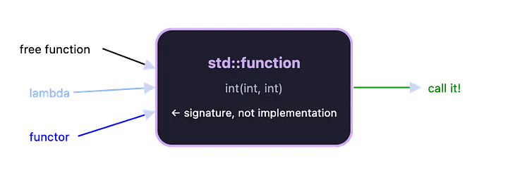

<div align="right">

[🇺🇸 English](../../en/cpp11/function.md) | [🇮🇷 فارسی](./function.md)

</div>

# `std::function`

فرض کنید در حال ساخت یک سیستم رویداد (**Event System**) هستید؛ مثلاً یک
دکمه که یک Callback مربوط به رویداد `onClick` را در خود نگه می‌دارد.

برای متغیر عضو این دکمه چه نوعی باید در نظر بگیریم؟

اگر از **Function Pointer** استفاده کنیم، Lambdaهایی که Capture دارند
قابل استفاده نخواهند بود. اگر از یک **Template Parameter** استفاده کنیم،
هر Callback متفاوت باعث ایجاد یک نوع متفاوت برای دکمه می‌شود.

ما به یک نوع یکنواخت نیاز داریم که بتواند هر شیء قابل‌فراخوانی
(**Callable**) سازگار با یک امضای مشخص را در خود نگه دارد. همچنین به
روشی نیاز داریم که بتواند Callableهایی را که دقیقاً با Signature مورد
انتظار مطابقت ندارند، با از پیش تعیین کردن بعضی آرگومان‌ها با آن
Signature سازگار کند.

**این دقیقاً همان کاری است که `std::function` و [`std::bind`](./bind.md)
انجام می‌دهند.**

------------------------------------------------------------------------

## `std::function`

می‌توان `std::function` را مانند یک **جعبه (Box)** در نظر گرفت که می‌تواند
هر چیزی را که با یک Signature مشخص قابل‌فراخوانی باشد، در خود نگه دارد.



`std::function` در C++ یک کلاس قالبی (**Template Class**) است که برای
ذخیره و فراخوانی اشیای قابل‌فراخوانی مانند موارد زیر استفاده می‌شود:

-   توابع معمولی
-   Lambda Expressionها
-   Functorها
-   Function Objectها
-   برخی Callableهای دیگر

این ابزار یک روش انعطاف‌پذیر و عمومی برای کار با اشیای قابل‌فراخوانی در
برنامه‌های C++ فراهم می‌کند.

-   می‌تواند انواع مختلف Callable را از طریق یک Interface یکسان مدیریت
    کند.
-   معمولاً در Callbackها، مدیریت رویدادها و برنامه‌نویسی تابعی
    (**Functional Programming**) استفاده می‌شود.
-   انعطاف‌پذیری، قابلیت استفاده مجدد و نگهداری (**Maintainability**) کد
    را افزایش می‌دهد.

### مثال ساده

``` cpp
#include <iostream>
#include <functional>

using namespace std;

int add(int a, int b)
{
    return a + b;
}

int main()
{
    function<int(int, int)> f = add;

    cout << f(10, 20);

    return 0;
}
```

در این مثال:

``` cpp
function<int(int, int)> f = add;
```

یک `std::function` ایجاد شده که می‌تواند هر Callable با Signature زیر را
نگه دارد:

``` cpp
int(int, int)
```

سپس تابع `add` داخل آن قرار گرفته و با استفاده از `f` فراخوانی می‌شود:

``` cpp
f(10, 20);
```

------------------------------------------------------------------------

## `std::function` با انواع مختلف Callable

یکی از ویژگی‌های مهم `std::function` این است که یک متغیر از نوع
`std::function` می‌تواند در طول عمر خود Callableهای مختلفی را نگه دارد.

``` cpp
#include <bits/stdc++.h>

using namespace std;

int f(int a, int b)
{
    return a + b;
}

int main()
{
    // std::function دربرگیرنده یک تابع معمولی
    function<int(int, int)> calc = f;

    cout << "Sum: " << calc(8, 2) << endl;

    // std::function دربرگیرنده یک Lambda Expression
    calc = [](int a, int b)
    {
        return a * b;
    };

    cout << "Product: " << calc(8, 2);

    return 0;
}
```

در این مثال، ابتدا `calc` تابع `f` را نگه می‌دارد و سپس همان
`std::function` با یک Lambda جایگزین می‌شود.

نکته مهم این است که هر دو Callable دارای Signature یکسان هستند:

``` cpp
int(int, int)
```

------------------------------------------------------------------------

## تعریف `std::function`

برای ایجاد یک Wrapper می‌توان از Syntax زیر استفاده کرد:

``` cpp
std::function<rtype(atype...)> name;
```

### اجزای Syntax

-   **`name`**: نام Wrapper.
-   **`atype`**: نوع آرگومان‌هایی که تابع دریافت می‌کند.
-   **`rtype`**: نوع مقدار بازگشتی تابعی که می‌خواهید ذخیره کنید.

### مثال

``` cpp
std::function<int(int, int)> calc;
```

در اینجا:

-   `int` اول → نوع مقدار بازگشتی
-   `int, int` → نوع دو آرگومان
-   `calc` → نام `std::function`

بنابراین `calc` می‌تواند Callableهایی را نگه دارد که Signature آن‌ها معادل
زیر باشد:

``` cpp
int(int, int)
```

------------------------------------------------------------------------

# توابع عضو `std::function`

`std::function` چند عملیات مهم دارد:

  -----------------------------------------------------------------------
  تابع                                توضیح
  ----------------------------------- -----------------------------------
  `swap()`                            Callable ذخیره‌شده در دو شیء
                                      `std::function` را با یکدیگر جابه‌جا
                                      می‌کند.

  `operator bool`                     بررسی می‌کند که آیا `std::function`
                                      دارای یک Callable معتبر است یا خیر.

  `operator()`                        Callable ذخیره‌شده را با آرگومان‌های
                                      داده‌شده فراخوانی می‌کند.

  `target()`                          اشاره‌گری به Callable ذخیره‌شده
                                      برمی‌گرداند. اگر Callable وجود
                                      نداشته باشد، `nullptr` برمی‌گرداند.

  `target_type()`                     نوع Callable ذخیره‌شده را به‌صورت
                                      `typeid` برمی‌گرداند. اگر Callable
                                      وجود نداشته باشد، `typeid(void)`
                                      برمی‌گرداند.
  -----------------------------------------------------------------------

### بررسی وجود Callable

می‌توان با `operator bool` بررسی کرد که آیا `std::function` مقدار معتبر
دارد یا خیر:

``` cpp
std::function<void()> func;

if (func)
{
    func();
}
```

در این مثال، چون `func` خالی است، شرط `if` برقرار نخواهد بود.

------------------------------------------------------------------------

# کاربردهای `std::function` در C++

علاوه بر مثال‌های بالا، `std::function` کاربردهای دیگری نیز دارد.

### Callbackها

در سیستم‌های **Event-Driven** می‌توان تابعی را به‌عنوان Callback ارسال کرد
تا بعداً هنگام رخ دادن یک رویداد فراخوانی شود.

### Function Wrapping و Higher-Order Functions

`std::function` امکان ارسال توابع به‌عنوان آرگومان و همچنین بازگرداندن
توابع را فراهم می‌کند.

### Stateful Callbacks

می‌توان Callbackهایی ایجاد کرد که وضعیت (**State**) خود را حفظ می‌کنند.
این ویژگی مدیریت State را بدون نیاز به متغیرهای Global آسان‌تر می‌کند.

### جایگزین Function Pointer

`std::function` می‌تواند جایگزین انعطاف‌پذیرتری برای Function Pointerهای
سنتی باشد، زیرا می‌تواند انواع مختلف Callable را در یک Interface مشترک
نگه دارد.

------------------------------------------------------------------------

# مثال‌های `std::function`

## ارسال `std::function` به‌عنوان آرگومان (Callback)

می‌توان یک `std::function` را به‌عنوان پارامتر یک تابع دریافت کرد.

``` cpp
#include <bits/stdc++.h>

using namespace std;

// توابع مربوط به عملیات ساده ریاضی

int add(int a, int b)
{
    return a + b;
}

int sub(int a, int b)
{
    return a - b;
}

int mul(int a, int b)
{
    return a * b;
}

int divs(int a, int b)
{
    return a / b;
}

// استفاده از std::function به‌عنوان پارامتر
void func(int a, int b, function<int(int, int)> calc)
{
    int res = calc(a, b);

    cout << "Result: " << res << endl;
}

int main()
{
    // فراخوانی تمام توابع حسابی

    func(8, 2, add);
    func(8, 2, sub);
    func(8, 2, mul);
    func(8, 2, divs);

    return 0;
}
```

در این مثال، تابع `func` یک `std::function` دریافت می‌کند:

``` cpp
function<int(int, int)> calc
```

بنابراین می‌توان توابع مختلفی مانند `add`، `sub`، `mul` و `divs` را به آن
ارسال کرد؛ زیرا همه آن‌ها Signature یکسانی دارند:

``` cpp
int(int, int)
```

------------------------------------------------------------------------

# قرار دادن توابع عضو کلاس در `std::function`

همچنین می‌توان یک تابع عضو کلاس را در یک شیء `std::function` قرار داد.

برای این کار باید نوع شیء کلاس نیز در Signature مربوط به `std::function`
در نظر گرفته شود.

``` cpp
#include <bits/stdc++.h>

using namespace std;

class C
{
public:
    int f(int a, int b)
    {
        return a * b;
    }
};

int main()
{
    C c;

    // قرار دادن تابع عضو کلاس C در std::function
    function<int(C&, int, int)> calc = &C::f;

    // فراخوانی تابع عضو از طریق std::function
    if (calc)
        cout << "Product: " << calc(c, 4, 5);
    else
        cout << "No Callable Assigned";

    return 0;
}
```

در اینجا:

``` cpp
function<int(C&, int, int)> calc = &C::f;
```

اولین آرگومان `C&` مربوط به شیئی است که تابع عضو باید روی آن اجرا شود.

بنابراین:

``` cpp
calc(c, 4, 5);
```

تقریباً معادل با این است:

``` cpp
c.f(4, 5);
```

خروجی:

``` text
Product: 20
```

------------------------------------------------------------------------

# ترکیب دو تابع در یک تابع

یکی دیگر از کاربردهای `std::function`، ترکیب چند تابع با یکدیگر است.

در مثال زیر دو تابع Lambda با هم ترکیب می‌شوند:

``` cpp
#include <bits/stdc++.h>

using namespace std;

// تابع ترکیبی
function<int(int)> cf(
    function<int(int)> f1,
    function<int(int)> f2)
{
    // برگرداندن یک Lambda Expression
    // که خود یک تابع ایجاد می‌کند
    return [f1, f2](int x)
    {
        // ابتدا f1 و سپس f2 اجرا می‌شود
        return f2(f1(x));
    };
}

int main()
{
    auto add = [](int x)
    {
        return x + 2;
    };

    auto mul = [](int x)
    {
        return x * 3;
    };

    function<int(int)> calc = cf(add, mul);

    cout << calc(4);

    return 0;
}
```

در این مثال، دو Lambda داریم:

``` cpp
auto add = [](int x)
{
    return x + 2;
};
```

و:

``` cpp
auto mul = [](int x)
{
    return x * 3;
};
```

تابع `cf` این دو تابع را دریافت کرده و آن‌ها را در یک تابع جدید ترکیب
می‌کند:

``` cpp
return f2(f1(x));
```

بنابراین ابتدا `add` اجرا می‌شود و سپس نتیجه آن به `mul` داده می‌شود.

برای مقدار `4`:

``` text
4 + 2 = 6
6 × 3 = 18
```

در نتیجه خروجی برنامه:

``` text
18
```

خواهد بود.

------------------------------------------------------------------------

# نکته مهم درباره عملکرد `std::function`

`std::function` دارای هزینه (**Overhead**) است؛ بنابراین باید در بخش‌هایی
از برنامه که عملکرد بسیار حساس است (**Hot Path**) با دقت از آن استفاده
کرد.

فراخوانی از طریق `std::function` معمولاً به‌صورت **Type-Erased** و
غیرمستقیم انجام می‌شود و در بسیاری از موارد مانع از **Inlining** شدن
فراخوانی Callable می‌شود.

همچنین اگر Callable در فضای داخلی کوچک `std::function` جا نشود، ممکن است
برای ذخیره آن نیاز به تخصیص حافظه روی **Heap** باشد. این رفتار با مفهوم
**Small Object Optimization (SOO)** مرتبط است.

بنابراین برای بخش‌های حساس از نظر Performance، بهتر است هزینه
`std::function` را در طراحی و Benchmark برنامه در نظر بگیرید.

## خلاصه

`std::function` یک Wrapper عمومی برای نگهداری و فراخوانی Callableها در
C++ است.

به‌طور خلاصه:

-   می‌تواند Function، Lambda و Functor را نگه دارد.
-   یک Interface مشترک برای Callableهای مختلف فراهم می‌کند.
-   برای Callbackها و Event Handling بسیار کاربردی است.
-   می‌تواند به‌عنوان پارامتر یا مقدار بازگشتی تابع استفاده شود.
-   در صورت نیاز به Performance بسیار بالا، باید Overhead مربوط به Type
    Erasure و احتمال تخصیص حافظه را در نظر گرفت.


## 🤝 مشارکت کنندگان

<div align="center">

| GitHub | LinkedIn | Email | Site | Telegram |
|--------|----------|-------|------|----------|
| [mbr](https://github.com/mbr1376) | [mbr](https://www.linkedin.com/in/mbr1376/) | m.roodsarabi76@gmail.com | | [mbr](https://t.me/ad1mi2n) |

</div>